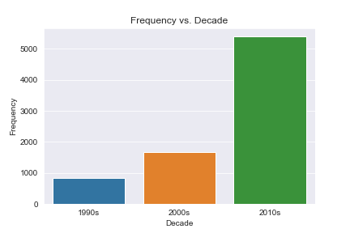
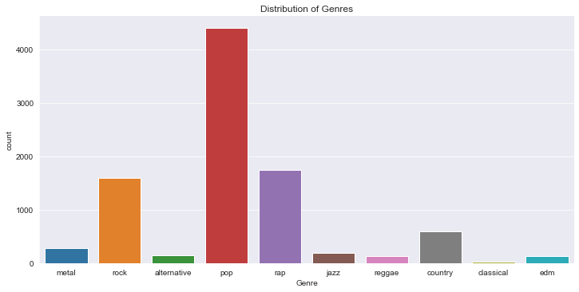
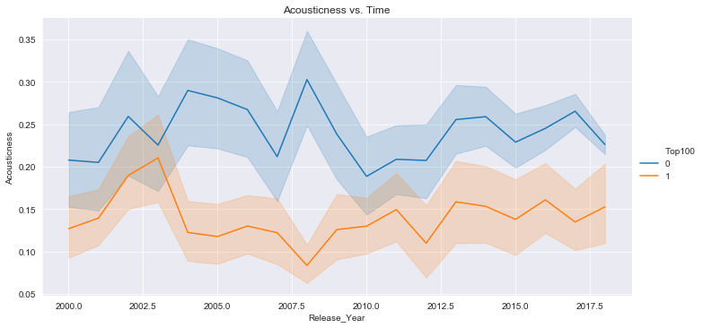
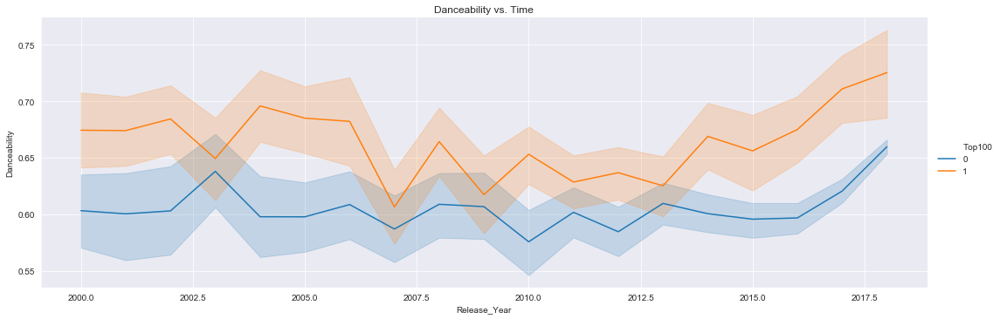
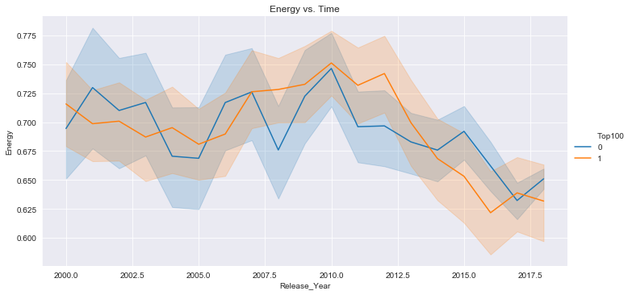
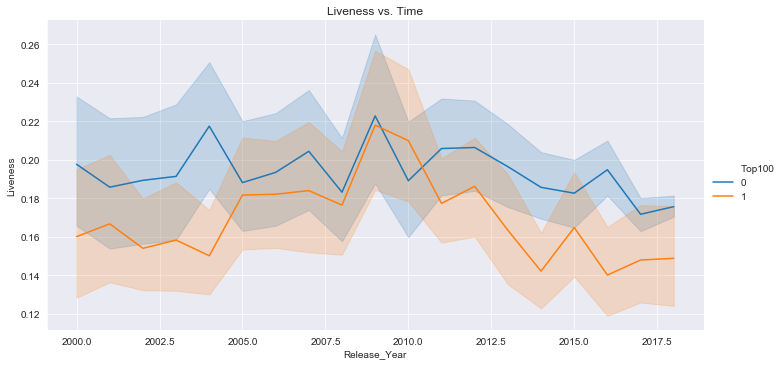
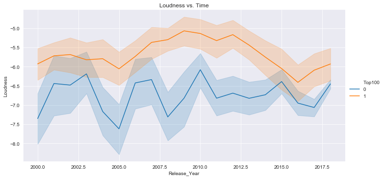
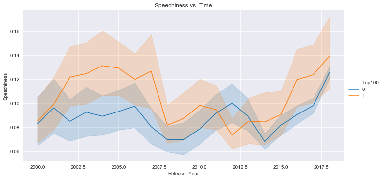
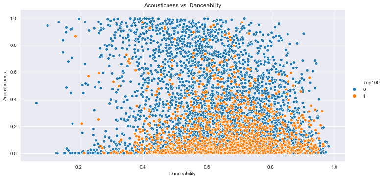
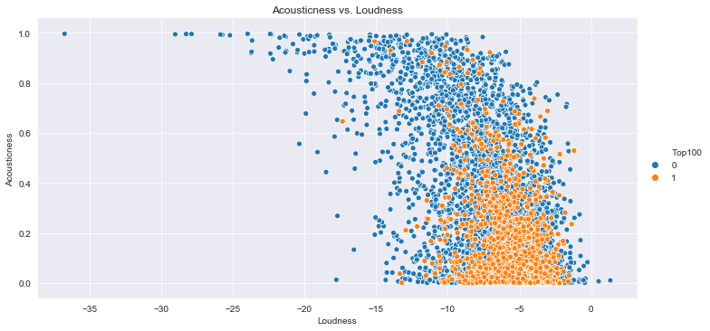

# Billboard Hot 100 Hit Prediction
:notes: Predicting Billboard's Year-End Hot 100 Songs using audio features from Spotify and lyrics from Musixmatch

## Overview
Each year, Billboard publishes its Year-End Hot 100 songs list, which denotes the top 100 songs of that year. The objective of this project was to see whether or not a machine learning classifier could predict whether a song would become a hit *(known as [Hit Song Science](https://en.wikipedia.org/wiki/Hit_Song_Science))* given its intrinsic audio features as well as lyrics.

## Data and Features
A sample of 19000 Spotify songs was downloaded from [Kaggle](https://www.kaggle.com/edalrami/19000-spotify-songs), which included songs from various Spotify albums. Additionally, Billboard charts from 1964-2018 were scraped from Billboard and Wikipedia.

Using Spotify's Audio Features & Analysis API, the following [features](https://developer.spotify.com/documentation/web-api/reference/tracks/get-audio-features/) were collected for each song: 
- **Mood**: Danceability, Valence, Energy, Tempo
- **Properties**: Loudness, Speechiness, Instrumentalness
- **Context**: Liveness, Acousticness

Additonally, lyrics were collected for each song using the [Musixmatch API](https://developer.musixmatch.com/documentation/api-reference/track-lyrics-get). I took a bag-of-words NLP approach to build a highly sparse (86%) matrix of unique words.

After cleaning the data, a dataset of approx. 10000 songs was created.

## Exploratory Data Analysis

**Spotify Features over Time**

The above graphs clearly show that audio features evolve over time. More importantly, the separability of data in certain graphs such as *Acousticness vs. Time* and *Loudness vs. Time* indicates potentially significant features that can help distinguish between the two classes.

**Feature Comparisons**

The above graphs show the separability in the data when compared across two unique Spotify features; this suggests that data may separate across an n-dimensional feature space. Given this, the problem can alternatively be posed as an unsupervised learning problem where clustering methods can classify the data.

## Models
Given the unbalanced nature of the dataset, any model chosen would automatically yield high accuracy. So, in addition to aiming for high accuracy, another objective of modelling is to ensure a high AUC (so that TPR is maximized and FPR is minimized). The AUC tells us how well the model is capable of distinguishing between the two classes.

Also, after EDA, I decided to only consider songs released between 2000-2018 because it is evident that music trends and acoustic features change over time, and song characteristics of the '90s would probably be not reflective of 00's and 10's decades. *(Note: For the sake of sample size I decided to combine '00s and '10s decades together. However, with the conglomeration of more songs and awards, it is probably better to consider a smaller time window)*

Here's a list of all the models I tested:
  1. Logistic Regression
  2. Backward Stepwise Logistic Regression
  3. LDA
  4. 10-fold CV CART
  5. Random Forest
  6. Bagging
  7. 10-fold CV KNN
